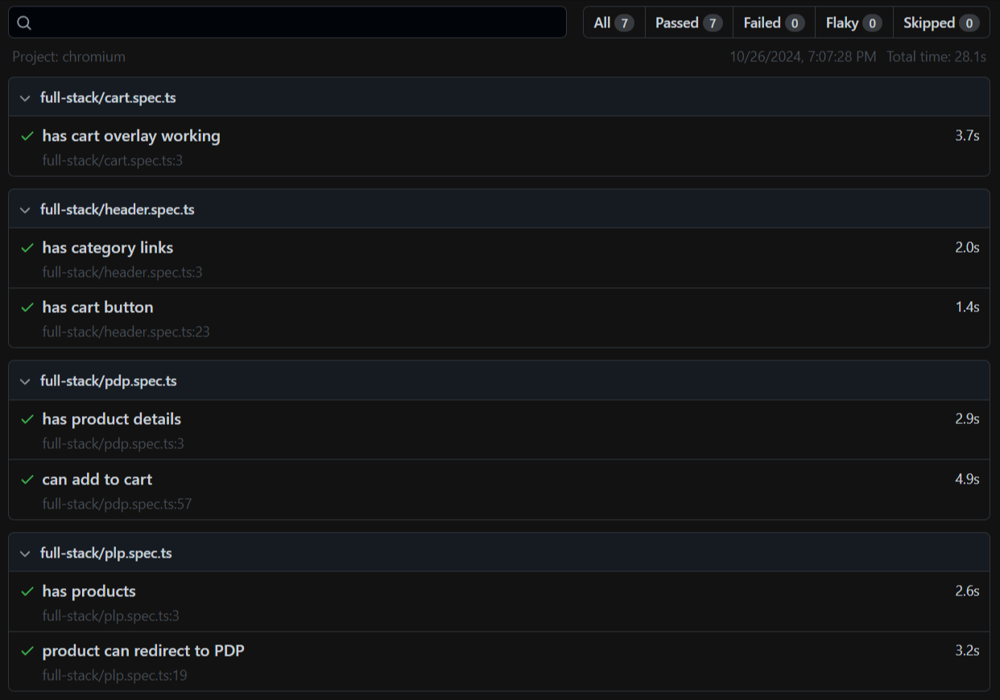
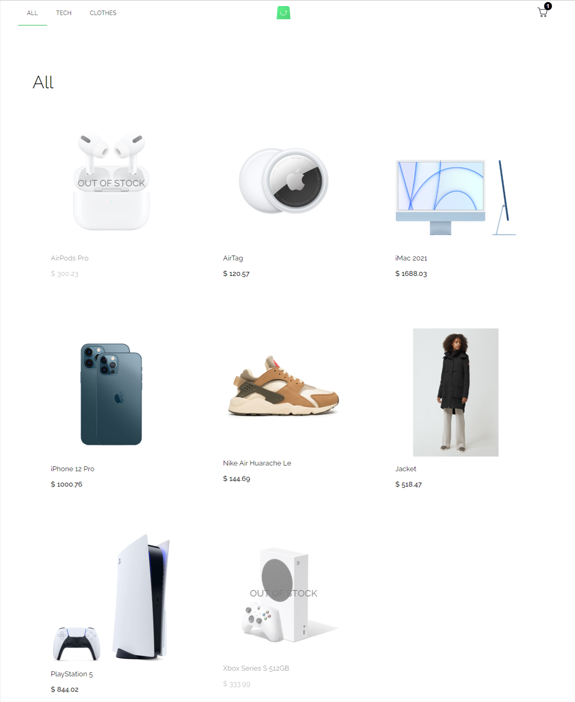
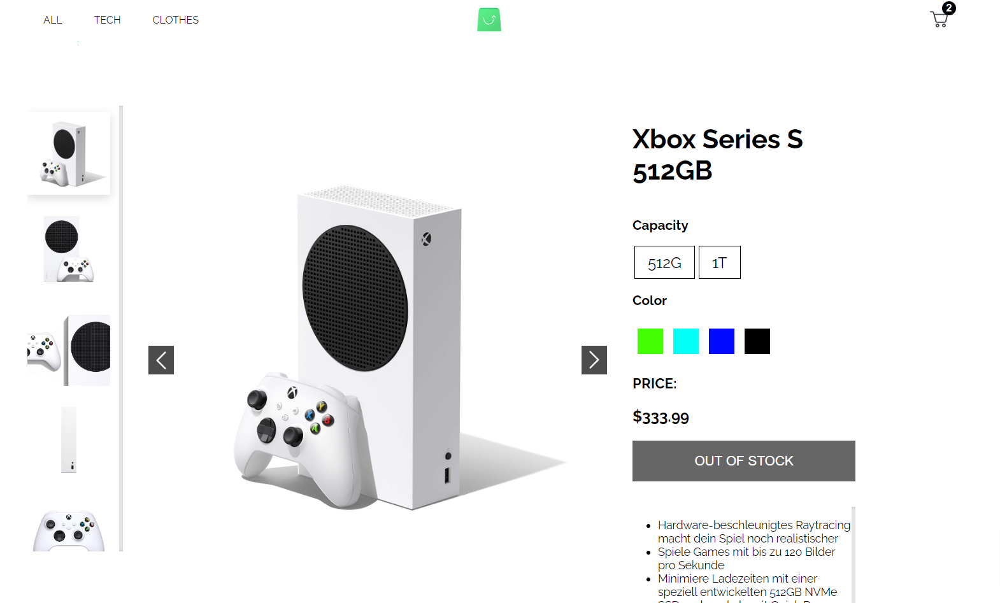
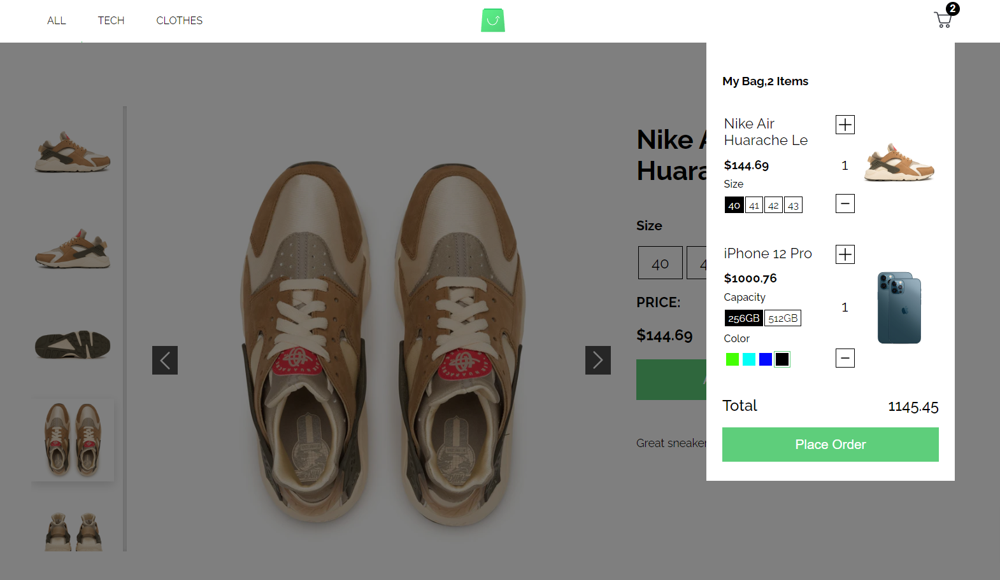

# E-commerce app
> A simple eCommerce website with product listing, and cart functionality created as a Junior Full Stack Developer test task. 

## Description
This App includes 2 Main Pages
### Product Listing Pages (Categories)
- Displays a list of products within a selected category.
- Default view of the website, showcasing the first category upon initial load.
### Product Details Page (PDP)
- Shows details about a selected product, including images, attributes and description.
- Allows users to configure their product options before adding the item to the cart.
- Provides an "Add to Cart" button for Fast shopping.

## Auto QA Test

## Interface

## Technologies
### Backend:
- PHP
- MySQL
- GraphQL
### Frontend:
- ReactJS (using class components only)
- Plain CSS

## Deployment
> The application is deployed on InfinityFree, a free hosting service that provides PHP and MySQL support.
> You can access via link : http://fullstack-php-account.000.pe

## Authors
- **Mohammed Shady** - _GitHub Profile_: [mohammedshady](https://github.com/mohammedshady) | _Email_: mohatech777@gmail.com

If you encounter any issues or have suggestions for improvements, please reach out via email. Your feedback is valuable and helps me enhance the app for everyone.

